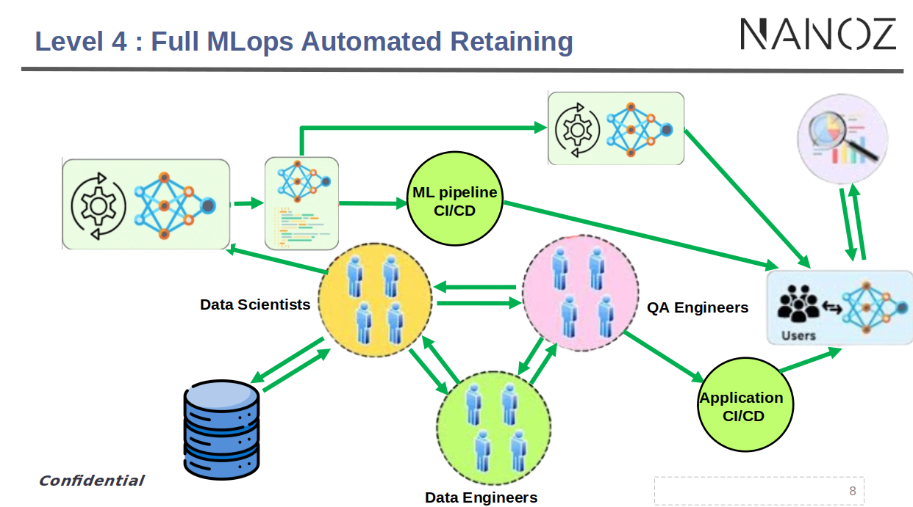

# README

## Table of Contents
1. [Introduction](#introduction)
2. [Tools Used](#tools-used)
3. [How to Install and Setup the Application](#how-to-install-and-setup-the-application)
4. [How to Pull the Project and Data](#how-to-pull-the-project-and-data)
5. [Running the Pipeline](#Running-the-Pipeline)
6. [Roadmap](#roadmap)
7. [Useful Links](#useful-links)


## Introduction
The project is a robust MLOps pipeline that emphasizes CI/CD principles. The primary goal is to facilitate seamless integration and deployment of machine learning models. This pipeline is designed to react to any modifications in the data or functions by triggering a series of automated steps including debugging, testing, training, and deploying the model to the cloud.



Key features of the pipeline:
- **Data Versioning and Control**: Utilizing DVC to manage data changes effectively.
- **Model Tracking**: Implementing MLflow to keep track of experiments, metrics, and parameters.
- **Deployment**: Using BentoML to deploy models efficiently.

This approach ensures that any change in the data or codebase automatically initiates the pipeline, maintaining the integrity and performance of the deployed models.


## Tools Used
- **DVC**: Data Version Control for managing datasets and versions.
- **VSCode**: Integrated Development Environment for coding and debugging.
- **Google Drive**: Cloud storage for data management.
- **MLflow**: Platform for managing the lifecycle of machine learning models.
- **BentoML**: Framework for serving and deploying machine learning models.


## How to Install and Setup the Application
1. Clone the repository and switch to the verified branch:
      Open your code editor (e.g., VSCode) to start working on the project.

   ```bash
   git clone -b verified <repository-url> ```
Install the required dependencies :

   ```bash 

    pip install -r requirements.txt
   ```

## How to Pull the Project and Data
   

 Copy the default.json and config.local files from Google Drive [Google Drive link ](https://drive.google.com/drive/u/1/folders/1qZcDnGG_C6GGu6utLibneuWQI5j67VTY) and place them inside the ./.dvc folder in your project directory.
    Pull the data using DVC:

  ```sh

     dvc pull
  ```

3. How to add data in the reprosetory

    add data to the ./data folder and after run the commande :
      ```sh
            dvc add data
      ```
   and after run :
      ```sh
             dvc push
      ```
# Running the Pipeline

## 1. Running the Pipeline Locally

To run the pipeline locally, follow these steps:

1. **Reproduce the Pipeline:**
   
   Simply run the following command to reproduce the pipeline:
   ```sh
   dvc repro
   ```
2. Pushing Results to Google Drive

   After running the pipeline locally, you may want to push the results to a remote storage (Google Drive in this case). Follow these steps:

    Add the Output Folder to DVC:

    ```sh

    dvc add csv_out 
   ```
3. Push the Results to Remote Storage:

Push the results to your remote storage (e.g., myremote2):

```sh

    dvc push -r myremote2
```
## 2.Setting Up an Automated Pipeline

To set up an automated pipeline, you need to add your data, push the data and code, and then push everything to your remote repository. Here's how you can do it:

Add the Data to the Local Folder:

- Add your data folder (e.g., data) to DVC tracking:

```sh

      dvc add data
```
- Push the Data to Remote Storage:


```sh

      dvc push
```

- Push the Code to the Git Repository:

Add all changes to Git, commit them, and push to your remote Git repository:

```sh

      git add .
      git commit -m "add data"
      git push
```
Following these steps ensures that your pipeline is automated and the data and code are properly tracked and stored in both DVC and Git repositories.
## Roadmap

 - [ ] Add Unit Tests
 - [ ] Correct Project Directory Structure (Arborescence)
 - [ ] Enable Handling of Large Datasets
 - [ ] Enhance Visualization Components
## Useful Links

- [DVC using google drive](https://dvc.org/doc/user-guide/data-management/remote-storage/google-drive)
- [DVC and CML](https://cml.dev/doc/cml-with-dvc)
- [DVC Documentation](https://dvc.org/doc)
